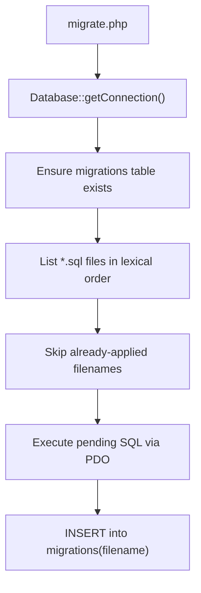
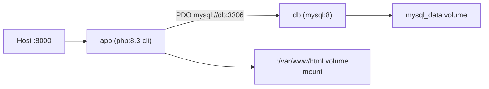

# PHP 8.3 REST API Backend

A lightweight, Dockerized REST API for user registration, login, and profile access. Built without a framework — plain PHP with a simple MVC-style layout, JWT authentication, and MySQL persistence.

## Quick start

```bash
cp .env.example .env
docker compose up -d --build
docker compose exec app composer install
docker compose exec app php migrate.php
curl http://localhost:8000/health
```

Expected health response:

```json
{"status":"ok","database":"connected"}
```

## API endpoints

| Method | Path | Auth | Description |
|--------|------|------|-------------|
| GET | `/health` | No | Service and database connectivity check |
| POST | `/api/register` | No | Create a new user account |
| POST | `/api/login` | No | Authenticate and receive a JWT |
| GET | `/api/profile` | Bearer JWT | Return the authenticated user's profile |

### Request / response examples

**Register** — `POST /api/register`

```json
{ "email": "user@example.com", "password": "secret123", "name": "Jane Doe" }
```

Response `201`:

```json
{ "id": 1, "email": "user@example.com", "name": "Jane Doe", "created_at": "2026-06-06 12:00:00" }
```

**Login** — `POST /api/login`

```json
{ "email": "user@example.com", "password": "secret123" }
```

Response `200`:

```json
{ "token": "<jwt>", "expires_in": 3600 }
```

**Profile** — `GET /api/profile`

```
Authorization: Bearer <jwt>
```

Response `200`:

```json
{ "id": 1, "email": "user@example.com", "name": "Jane Doe", "created_at": "2026-06-06 12:00:00" }
```

### Error responses

All errors return JSON with a consistent shape:

```json
{ "error": "Validation failed", "details": { "email": "Invalid email" } }
```

The `details` field is included when field-level validation errors exist. When `APP_DEBUG=true`, unhandled `500` errors may also include debug details (`message`, `file`, `line`).

| Status | When |
|--------|------|
| 400 | Validation failed |
| 401 | Missing, invalid, or expired JWT |
| 404 | Route or resource not found |
| 409 | Email already registered |
| 500 | Unhandled server error |
| 503 | Database unreachable (`/health` only) |

---

## Request lifecycle

Every HTTP request enters through the front controller and flows through routing, optional middleware, and controller/service/repository layers.


Step-by-step:

1. **`public/index.php`** loads Composer autoloading and `.env`, builds a `Request` from PHP globals, registers routes from `routes/api.php`, and dispatches.
2. **`Router`** matches the HTTP method and path. Unmatched routes return `404` JSON immediately.
3. **Middleware** (when present) runs before the controller — e.g. `AuthMiddleware` validates the JWT and attaches `userId` to the request.
4. **Controller** reads the request, delegates to a service, and maps the result to a `Response`.
5. **Service** applies business rules (validation, password hashing, token generation).
6. **Repository** executes prepared SQL against MySQL via PDO.
7. **`Response::send()`** sets the HTTP status, `Content-Type: application/json`, and echoes the JSON body.
8. If any uncaught `Throwable` escapes, **`ExceptionHandler`** logs it via Monolog and returns a `500` JSON error (stack details only when `APP_DEBUG=true`).

The `/health` route is registered before database-dependent services are initialized, so it can return `503` even when MySQL is down.

---

## Authentication flow

Authentication is stateless JWT (HS256). Passwords are hashed with `password_hash()` and verified with `password_verify()`.


JWT payload fields:

- `sub` — user ID
- `email` — user email
- `iat` — issued-at timestamp
- `exp` — expiration timestamp (TTL from `JWT_TTL_SECONDS`, default 3600)

Protected routes require the header:

```
Authorization: Bearer <token>
```

---

## Database and migrations

Schema is managed by plain SQL files in `migrations/`, applied by the CLI runner `migrate.php`.



Run migrations inside the app container:

```bash
docker compose exec app php migrate.php
```

Current schema — **`users`** table (`migrations/001_create_users_table.sql`):

| Column | Type | Notes |
|--------|------|-------|
| `id` | BIGINT UNSIGNED | Primary key, auto-increment |
| `email` | VARCHAR(255) | Unique, not null |
| `password_hash` | VARCHAR(255) | Not null |
| `name` | VARCHAR(100) | Not null |
| `created_at` | TIMESTAMP | Default current timestamp |
| `updated_at` | TIMESTAMP | Auto-updated on change |

The `migrations` tracking table records which `.sql` files have been applied.

---

## Docker setup

Two containers work together: the PHP app and MySQL.



| Service | Image / build | Role |
|---------|---------------|------|
| `app` | Built from `Dockerfile` | Runs `php -S 0.0.0.0:8000 -t public`; source mounted for hot reload |
| `db` | `mysql:8` | Persistent MySQL; health-checked before `app` starts |

The `app` container:

- Installs the PDO MySQL extension
- Exposes port `8000` (configurable via `APP_PORT`)
- Reads environment from `.env`
- Logs to stdout via Monolog (visible with `docker compose logs app`)

The `db` container:

- Creates database and user from env vars
- Persists data in the `mysql_data` Docker volume
- Exposes port `3306` for optional host-side debugging

---

## File reference

| Path | Purpose |
|------|---------|
| `public/index.php` | Front controller — bootstrap, route dispatch, global exception handling |
| `migrate.php` | CLI migration runner; creates tracking table and applies pending SQL |
| `routes/api.php` | Route table, dependency wiring, middleware attachment |
| `controllers/AuthController.php` | `POST /api/register` and `POST /api/login` handlers |
| `controllers/ProfileController.php` | `GET /api/profile` handler |
| `controllers/HealthController.php` | `GET /health` with database ping |
| `services/AuthService.php` | Registration, login, validation, password hashing |
| `services/UserService.php` | Profile lookup and response formatting |
| `services/JwtService.php` | JWT sign/verify (HS256 via firebase/php-jwt) |
| `repositories/UserRepository.php` | User CRUD queries with prepared statements |
| `models/User.php` | Plain user entity mapped from database rows |
| `middleware/AuthMiddleware.php` | Extracts Bearer token, validates JWT, sets `userId` on request |
| `core/Router.php` | Method/path matching and middleware pipeline |
| `core/Request.php` | HTTP request wrapper (method, path, headers, JSON body, attributes) |
| `core/Response.php` | JSON response builder with consistent error shape |
| `core/ExceptionHandler.php` | Logs and formats uncaught exceptions as JSON 500 |
| `core/Validator.php` | Rule-based field validation (`required`, `email`, `minLength`, `maxLength`) |
| `core/Database.php` | PDO singleton factory |
| `core/Logger.php` | Monolog wrapper writing to stdout |
| `config/app.php` | App environment, debug flag, port |
| `config/database.php` | Database connection settings from env |
| `config/jwt.php` | JWT secret, TTL, algorithm |
| `migrations/001_create_users_table.sql` | Initial `users` table schema |
| `Dockerfile` | PHP 8.3 CLI image with PDO MySQL and Composer |
| `docker-compose.yml` | `app` + `db` services, volumes, health checks |
| `.env.example` | Template environment variables |
| `composer.json` | Dependencies and PSR-4 autoloading (`App\\` → project root) |

---

## Environment variables

Copy `.env.example` to `.env` and adjust as needed:

| Variable | Default | Description |
|----------|---------|-------------|
| `APP_ENV` | `local` | Environment name |
| `APP_DEBUG` | `true` | Include exception details in 500 responses |
| `APP_PORT` | `8000` | Host port mapped to the app container |
| `MYSQL_ROOT_PASSWORD` | `rootsecret` | MySQL root password (db container) |
| `DB_HOST` | `db` | Database hostname (Docker service name) |
| `DB_PORT` | `3306` | Database port |
| `DB_NAME` | `app` | Database name |
| `DB_USER` | `app` | Database user |
| `DB_PASSWORD` | `secret` | Database password |
| `JWT_SECRET` | — | HMAC secret for signing JWTs (change in production) |
| `JWT_TTL_SECONDS` | `3600` | Token lifetime in seconds |

---

## Development commands

```bash
# Start containers
docker compose up -d --build

# Install / update PHP dependencies
docker compose exec app composer install

# Run pending migrations
docker compose exec app php migrate.php

# Tail application logs
docker compose logs -f app

# Stop containers
docker compose down
```

To reset the database entirely (destroys persisted data):

```bash
docker compose down -v
docker compose up -d --build
docker compose exec app php migrate.php
```

---

## Dependencies

| Package | Purpose |
|---------|---------|
| `firebase/php-jwt` | JWT signing and verification |
| `vlucas/phpdotenv` | Load `.env` configuration |
| `monolog/monolog` | Structured logging to stdout |
