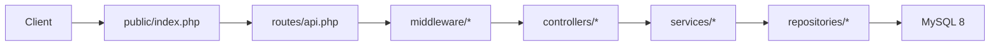
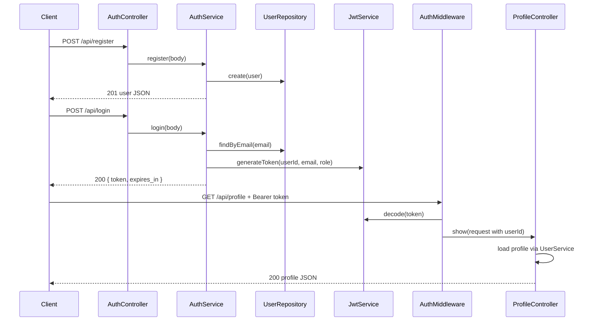
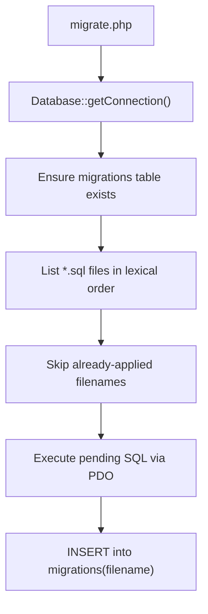
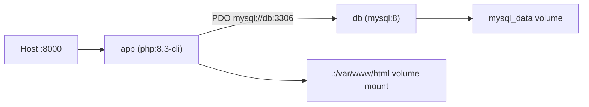

# PHP 8.3 REST API Backend

A lightweight, Dockerized REST API for user authentication, product catalog, shopping cart, checkout, order history, and admin management. Built without a framework — plain PHP with a simple MVC-style layout, JWT authentication, and MySQL persistence.

## Quick start

```bash
cp .env.example .env
docker compose up -d --build
docker compose exec app composer install
docker compose exec app php migrate.php
curl http://localhost:8000/health
```

Expected health response:

```json
{"status":"ok","database":"connected"}
```

## API endpoints

| Method | Path | Auth | Description |
|--------|------|------|-------------|
| GET | `/health` | No | Service and database connectivity check |
| POST | `/api/register` | No | Create a new user account (`role: user`) |
| POST | `/api/admin/register` | No | Create a new admin account |
| POST | `/api/login` | No | Authenticate and receive a JWT |
| GET | `/api/profile` | Bearer JWT | Return the authenticated user's profile |
| GET | `/api/categories` | No | List all categories |
| GET | `/api/categories/{id}` | No | Category detail |
| POST | `/api/admin/categories` | Admin JWT | Create category |
| PUT | `/api/admin/categories/{id}` | Admin JWT | Update category |
| DELETE | `/api/admin/categories/{id}` | Admin JWT | Delete category (blocked if products exist) |
| GET | `/api/products` | No | List products (`?category_id=` optional) |
| GET | `/api/products/{id}` | No | Product detail |
| POST | `/api/admin/products` | Admin JWT | Create product |
| PUT | `/api/admin/products/{id}` | Admin JWT | Update product |
| DELETE | `/api/admin/products/{id}` | Admin JWT | Delete product |
| GET | `/api/cart` | Bearer JWT | View cart with line totals |
| POST | `/api/cart/items` | Bearer JWT | Add or update cart item quantity |
| DELETE | `/api/cart/items/{productId}` | Bearer JWT | Remove item from cart |
| POST | `/api/checkout` | Bearer JWT | Create order from cart + shipping address |
| GET | `/api/orders` | Bearer JWT | Own order history (newest first) |
| GET | `/api/orders/{id}` | Bearer JWT | Own order detail |
| GET | `/api/admin/dashboard` | Admin JWT | Summary stats and recent orders |
| GET | `/api/admin/orders` | Admin JWT | All orders |
| GET | `/api/admin/orders/{id}` | Admin JWT | Any order detail |
| PATCH | `/api/admin/orders/{id}` | Admin JWT | Update order status |

**Auth legend:** *Bearer JWT* = any authenticated user. *Admin JWT* = user with `role: admin` in the token payload.

---

## curl examples

Set the base URL once:

```bash
BASE=http://localhost:8000
```

### Auth and profile

**Register user**

```bash
curl -s -X POST "$BASE/api/register" \
  -H "Content-Type: application/json" \
  -d '{"email":"user@example.com","password":"secret123","name":"Jane Doe"}'
```

**Register admin**

```bash
curl -s -X POST "$BASE/api/admin/register" \
  -H "Content-Type: application/json" \
  -d '{"email":"admin@example.com","password":"secret123","name":"Admin User"}'
```

**Login** (save the token for later requests)

```bash
TOKEN=$(curl -s -X POST "$BASE/api/login" \
  -H "Content-Type: application/json" \
  -d '{"email":"user@example.com","password":"secret123"}' | jq -r '.token')

ADMIN_TOKEN=$(curl -s -X POST "$BASE/api/login" \
  -H "Content-Type: application/json" \
  -d '{"email":"admin@example.com","password":"secret123"}' | jq -r '.token')
```

**Profile**

```bash
curl -s "$BASE/api/profile" -H "Authorization: Bearer $TOKEN"
```

Response includes `role` (`user` or `admin`).

### Categories (public read)

```bash
curl -s "$BASE/api/categories"
curl -s "$BASE/api/categories/1"
```

Seeded categories after migration: **Clothes**, **Shoes**, **Bags**.

**Admin — create category**

```bash
curl -s -X POST "$BASE/api/admin/categories" \
  -H "Authorization: Bearer $ADMIN_TOKEN" \
  -H "Content-Type: application/json" \
  -d '{"name":"Accessories"}'
```

**Admin — update / delete**

```bash
curl -s -X PUT "$BASE/api/admin/categories/4" \
  -H "Authorization: Bearer $ADMIN_TOKEN" \
  -H "Content-Type: application/json" \
  -d '{"name":"Watches"}'

curl -s -X DELETE "$BASE/api/admin/categories/4" \
  -H "Authorization: Bearer $ADMIN_TOKEN"
```

### Products

```bash
curl -s "$BASE/api/products"
curl -s "$BASE/api/products?category_id=1"
curl -s "$BASE/api/products/1"
```

**Admin — create product**

```bash
curl -s -X POST "$BASE/api/admin/products" \
  -H "Authorization: Bearer $ADMIN_TOKEN" \
  -H "Content-Type: application/json" \
  -d '{
    "category_id": 1,
    "name": "Classic T-Shirt",
    "description": "Cotton crew neck",
    "price": "19.99",
    "stock": 100
  }'
```

**Admin — update / delete**

```bash
curl -s -X PUT "$BASE/api/admin/products/1" \
  -H "Authorization: Bearer $ADMIN_TOKEN" \
  -H "Content-Type: application/json" \
  -d '{"stock": 95}'

curl -s -X DELETE "$BASE/api/admin/products/1" \
  -H "Authorization: Bearer $ADMIN_TOKEN"
```

### Cart and checkout

**View cart**

```bash
curl -s "$BASE/api/cart" -H "Authorization: Bearer $TOKEN"
```

**Add or update item**

```bash
curl -s -X POST "$BASE/api/cart/items" \
  -H "Authorization: Bearer $TOKEN" \
  -H "Content-Type: application/json" \
  -d '{"product_id": 1, "quantity": 2}'
```

**Remove item**

```bash
curl -s -X DELETE "$BASE/api/cart/items/1" \
  -H "Authorization: Bearer $TOKEN"
```

**Checkout**

```bash
curl -s -X POST "$BASE/api/checkout" \
  -H "Authorization: Bearer $TOKEN" \
  -H "Content-Type: application/json" \
  -d '{
    "shipping_name": "Jane Doe",
    "shipping_address": "123 Main St",
    "shipping_city": "Phnom Penh",
    "shipping_postal_code": "12000",
    "shipping_phone": "+85512345678"
  }'
```

### Order history (user)

```bash
curl -s "$BASE/api/orders" -H "Authorization: Bearer $TOKEN"
curl -s "$BASE/api/orders/1" -H "Authorization: Bearer $TOKEN"
```

### Admin dashboard and orders

**Dashboard stats**

```bash
curl -s "$BASE/api/admin/dashboard" \
  -H "Authorization: Bearer $ADMIN_TOKEN"
```

Example response:

```json
{
  "total_orders": 1,
  "total_revenue": "39.98",
  "total_users": 2,
  "total_products": 1,
  "recent_orders": [
    {
      "id": 1,
      "user_id": 1,
      "status": "pending",
      "total": "39.98",
      "shipping_name": "Jane Doe",
      "shipping_address": "123 Main St",
      "shipping_city": "Phnom Penh",
      "shipping_postal_code": "12000",
      "shipping_phone": "+85512345678",
      "created_at": "2026-06-06 12:00:00",
      "updated_at": "2026-06-06 12:00:00"
    }
  ]
}
```

**List all orders / order detail**

```bash
curl -s "$BASE/api/admin/orders" \
  -H "Authorization: Bearer $ADMIN_TOKEN"

curl -s "$BASE/api/admin/orders/1" \
  -H "Authorization: Bearer $ADMIN_TOKEN"
```

**Update order status**

Valid statuses: `pending`, `confirmed`, `shipped`, `delivered`, `cancelled`.

```bash
curl -s -X PATCH "$BASE/api/admin/orders/1" \
  -H "Authorization: Bearer $ADMIN_TOKEN" \
  -H "Content-Type: application/json" \
  -d '{"status": "confirmed"}'
```

---

## Request / response examples

**Register** — `POST /api/register`

```json
{ "email": "user@example.com", "password": "secret123", "name": "Jane Doe" }
```

Response `201`:

```json
{ "id": 1, "email": "user@example.com", "name": "Jane Doe", "role": "user", "created_at": "2026-06-06 12:00:00" }
```

**Login** — `POST /api/login`

```json
{ "email": "user@example.com", "password": "secret123" }
```

Response `200`:

```json
{ "token": "<jwt>", "expires_in": 3600 }
```

**Profile** — `GET /api/profile`

```
Authorization: Bearer <jwt>
```

Response `200`:

```json
{ "id": 1, "email": "user@example.com", "name": "Jane Doe", "role": "user", "created_at": "2026-06-06 12:00:00" }
```

### Error responses

All errors return JSON with a consistent shape:

```json
{ "error": "Validation failed", "details": { "email": "Invalid email" } }
```

The `details` field is included when field-level validation errors exist. When `APP_DEBUG=true`, unhandled `500` errors may also include debug details (`message`, `file`, `line`).

| Status | When |
|--------|------|
| 400 | Validation failed or business rule violation |
| 401 | Missing, invalid, or expired JWT |
| 403 | Authenticated but not authorized (e.g. non-admin on admin routes, or viewing another user's order) |
| 404 | Route or resource not found |
| 409 | Email already registered |
| 500 | Unhandled server error |
| 503 | Database unreachable (`/health` only) |

---

## Request lifecycle

Every HTTP request enters through the front controller and flows through routing, optional middleware, and controller/service/repository layers.



Step-by-step:

1. **`public/index.php`** loads Composer autoloading and `.env`, builds a `Request` from PHP globals, registers routes from `routes/api.php`, and dispatches.
2. **`Router`** matches the HTTP method and path (including `{id}` path parameters). Unmatched routes return `404` JSON immediately.
3. **Middleware** (when present) runs before the controller — e.g. `AuthMiddleware` validates the JWT and attaches `userId` and `role` to the request; `AdminMiddleware` requires `role: admin`.
4. **Controller** reads the request, delegates to a service, and maps the result to a `Response`.
5. **Service** applies business rules (validation, stock checks, transactional checkout).
6. **Repository** executes prepared SQL against MySQL via PDO.
7. **`Response::send()`** sets the HTTP status, `Content-Type: application/json`, and echoes the JSON body.
8. If any uncaught `Throwable` escapes, **`ExceptionHandler`** logs it via Monolog and returns a `500` JSON error (stack details only when `APP_DEBUG=true`).

The `/health` route is registered before database-dependent services are initialized, so it can return `503` even when MySQL is down.

---

## Authentication flow

Authentication is stateless JWT (HS256). Passwords are hashed with `password_hash()` and verified with `password_verify()`.



JWT payload fields:

- `sub` — user ID
- `email` — user email
- `role` — `user` or `admin`
- `iat` — issued-at timestamp
- `exp` — expiration timestamp (TTL from `JWT_TTL_SECONDS`, default 3600)

Protected routes require the header:

```
Authorization: Bearer <token>
```

Admin routes require a token issued to an admin account (`role: admin` in the JWT).

---

## Database and migrations

Schema is managed by plain SQL files in `migrations/`, applied by the CLI runner `migrate.php`.



Run migrations inside the app container:

```bash
docker compose exec app php migrate.php
```

Applied migrations (in order):

| File | Creates / changes |
|------|-------------------|
| `001_create_users_table.sql` | `users` table |
| `002_add_user_roles.sql` | `role` column on `users` |
| `003_create_categories_table.sql` | `categories` table + seed data |
| `004_create_products_table.sql` | `products` table |
| `005_create_cart_items_table.sql` | `cart_items` table |
| `006_create_orders_table.sql` | `orders` table |
| `007_create_order_items_table.sql` | `order_items` table |

The `migrations` tracking table records which `.sql` files have been applied.

---

## Docker setup

Two containers work together: the PHP app and MySQL.



| Service | Image / build | Role |
|---------|---------------|------|
| `app` | Built from `Dockerfile` | Runs `php -S 0.0.0.0:8000 -t public`; source mounted for hot reload |
| `db` | `mysql:8` | Persistent MySQL; health-checked before `app` starts |

The `app` container:

- Installs the PDO MySQL extension
- Exposes port `8000` (configurable via `APP_PORT`)
- Reads environment from `.env`
- Logs to stdout via Monolog (visible with `docker compose logs app`)

The `db` container:

- Creates database and user from env vars
- Persists data in the `mysql_data` Docker volume
- Exposes port `3306` for optional host-side debugging

---

## File reference

| Path | Purpose |
|------|---------|
| `public/index.php` | Front controller — bootstrap, route dispatch, global exception handling |
| `migrate.php` | CLI migration runner; creates tracking table and applies pending SQL |
| `routes/api.php` | Route table, middleware attachment |
| `core/RouteDependencies.php` | Manual DI wiring for repos, services, controllers, middleware |
| `controllers/AuthController.php` | Registration, admin registration, login |
| `controllers/ProfileController.php` | `GET /api/profile` |
| `controllers/CategoryController.php` | Public category read |
| `controllers/AdminCategoryController.php` | Admin category CRUD |
| `controllers/ProductController.php` | Public product read |
| `controllers/AdminProductController.php` | Admin product CRUD |
| `controllers/CartController.php` | Cart read, upsert, remove |
| `controllers/CheckoutController.php` | Checkout from cart |
| `controllers/OrderController.php` | User order history |
| `controllers/AdminDashboardController.php` | Admin dashboard stats |
| `controllers/AdminOrderController.php` | Admin order list, detail, status update |
| `controllers/HealthController.php` | `GET /health` with database ping |
| `services/*` | Business logic, validation, response formatting |
| `repositories/*` | SQL queries with prepared statements |
| `models/*` | Plain entities mapped from database rows |
| `middleware/AuthMiddleware.php` | JWT validation; sets `userId` and `role` on request |
| `middleware/AdminMiddleware.php` | Requires admin role |
| `core/Router.php` | Method/path matching, path params, middleware pipeline |
| `core/Request.php` | HTTP request wrapper (method, path, headers, JSON body, query string, attributes) |
| `core/Response.php` | JSON response builder with consistent error shape |
| `core/ExceptionHandler.php` | Logs and formats uncaught exceptions as JSON 500 |
| `core/Validator.php` | Rule-based field validation |
| `core/Database.php` | PDO singleton factory |
| `core/Logger.php` | Monolog wrapper writing to stdout |
| `config/*.php` | App, database, and JWT settings |
| `migrations/*.sql` | Versioned schema changes |
| `Dockerfile` | PHP 8.3 CLI image with PDO MySQL and Composer |
| `docker-compose.yml` | `app` + `db` services, volumes, health checks |
| `.env.example` | Template environment variables |

---

## Environment variables

Copy `.env.example` to `.env` and adjust as needed:

| Variable | Default | Description |
|----------|---------|-------------|
| `APP_ENV` | `local` | Environment name |
| `APP_DEBUG` | `true` | Include exception details in 500 responses |
| `APP_PORT` | `8000` | Host port mapped to the app container |
| `MYSQL_ROOT_PASSWORD` | `rootsecret` | MySQL root password (db container) |
| `DB_HOST` | `db` | Database hostname (Docker service name) |
| `DB_PORT` | `3306` | Database port |
| `DB_NAME` | `app` | Database name |
| `DB_USER` | `app` | Database user |
| `DB_PASSWORD` | `secret` | Database password |
| `JWT_SECRET` | — | HMAC secret for signing JWTs (change in production) |
| `JWT_TTL_SECONDS` | `3600` | Token lifetime in seconds |

---

## Development commands

```bash
# Start containers
docker compose up -d --build

# Install / update PHP dependencies
docker compose exec app composer install

# Run pending migrations
docker compose exec app php migrate.php

# Tail application logs
docker compose logs -f app

# Stop containers
docker compose down
```

To reset the database entirely (destroys persisted data):

```bash
docker compose down -v
docker compose up -d --build
docker compose exec app php migrate.php
```

---

## Dependencies

| Package | Purpose |
|---------|---------|
| `firebase/php-jwt` | JWT signing and verification |
| `vlucas/phpdotenv` | Load `.env` configuration |
| `monolog/monolog` | Structured logging to stdout |
